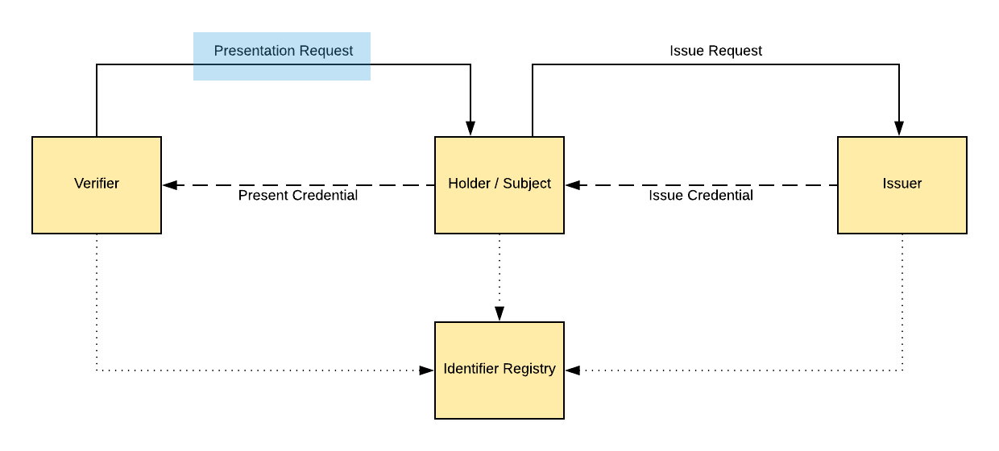

# Scoped Presentation Request on Verifiable Credentials
Martin Riedel, Civic Technologies, Inc.

## Abstract
We propose a new Standard for the Verifier - Holder interaction within the Verifiable Credential Ecosystem, where a Verifier can specify a request format towards the Holder of Credential Information that is satisfied by the presentation of the requested Credentials. In this "Presentation Request" a Verifier is able to define requirements towards the kind of Credential, Claims or ZKP Proofs that should be presented and if there are additional side constraints that need to be fulfilled. The proposed request defines a DSL to model constraints in a dynamic way, which the holder of Verifiable Credentials can match against its local store and identify satisfying or missing credentials. Lastly, the verifier utilizes the presentation request to setup an identifiable communication sequence by specifying key material and status endpoints for the transmission of request results (a set of matching Verifiable Presentations).

## Introduction
The Verifiable Credential (VC) Standard describes an data model consisting of a Credential Identifier, Claims, Metadata and Signature / Proof section. VC can be issued by an Issuer to an Subject, that can hold onto them for a specific timeframe. A Holder of a Credential is able to present those to a verifier that is able to verify the authenticity of the presented information independently. Functionally, the process of presenting a defined Verifiable Credential to a Verifier is often not initialized by the Holder of the Credential, but rather requested by the verifier to fulfill a specific need. Therefore, the process is often triggered by a Verifier requesting a specific Credential (therefore in the Civic Ecosystem they are called Requesters) and Holder of a matching Credential to present the result back to the verifier. In this paper, we propose to standardize this communication via a "Presentation Request".

A related requirement exists for the interaction of VC Subject and Issuer for requesting a Verifiable Credential and providing the required evidence within a Validation Protocol. This will not be covered within this paper and is part of a separate contribution.



*Presentation Request Interaction within an Identity Ecosystem. A Verifier (Requester) creates an Presentation Request towards an Credential Holder in order to present the required Credentials.*


## Functional Requirements
As a Verifier the Presentation Request should fulfill the following requirements:
- Define the required Verifiable Presentations of credentials, claims or dynamic proof elements (ZKP) that are know within an Identifier Registry.
- Define additional constraints on the payload contained within a Verifiable Credential (e.g. expireDate < today, issuingCountry eq "Germany").
- Define communication endpoints to receive the result of the request
- Proof the authenticity of the request by signing it with a Verifier specific key
- Specify a limited TTL by including a mandatory issuing timestamp (e.g. the verifier can be sure that no legacy or replayed request can be fulfilled)

As a Holder / Subject the Presentation Request should fulfill the following requirements:

- The requirements within a Presentation Request can be transformed into a human-readable format for
  - the required credential, claim or proof element identifiers
  - optional constrains that exist for an individual identifier
- Filter existing Verifiable Credentials towards matching Verifiable Presentations
- Verify validity and authenticity of a Presentation Request
- Secure communication setup for Verifiable Presentation transmission
- Specify a limited TTL by including a mandatory issuing timestamp (e.g. the holder can be sure that no legacy or replayed request can be fulfilled)

## Proposed Data Format:

```
{
  "version": "1",
  "timestamp": "2018-07-04T00:11:55.698Z",
  "requesterInfo": {
    "requesterId": "did:cvc:<requester-did>",
    "app": {
      "name": "App Name",
      "logo": "https://server/path/logo.png",
      "description": "App Description",
      "primaryColor": "2345EE",
      "secondaryColor": "2345FF"
    }
  },
  "credentialItems": [
    {
      "identifier": "credential-civ:Identity:GenericId-v1",
      "constraints": {
		"metadata": {
			"issuer": { is: { $eq: 'did:cvc:<validator-did>' } },
			"expiry": { is: { $gt: '2018-09-14T21:12:31+00:00' } },	
		}
        "claims": [
          { "path": "name.first", "is": {"$eq": "Martin"} }
        ]
      }
    }
  ],
  "channels": {
    "eventsURL": "https://requester-endpoint.com/events/UUID",
    "payloadURL": "https://requester-endpoint.com/payload/UUID"
  }
  "signature": {
	"signatureValue": ...
    "xpub": ...
	"algo": ...
  }
}
```
*Code: A example for a Presentation Request from an Verifier towards an Holder of Credential Information. The nomenclature of certain properties are still aligned for the Civic Ecosystem and not the Verifiable Credential Standard. (Requester → Verifier, Validator → Issuer).*

The proposed data format contains the following sections:

- Metadata of the Presentation Request, specifically a version and timestamp identifier that contains the point in time the request was created (in ISO 8601)
- A list of Requester / Verifier information that can be presented towards the Holder
- A list of required CredentialItems Identifiers that can reference a whole Verifiable Credential, a single (Sub-)Claim or a certain proof element within a Verifiable Credential.
- Optional constraints on each CredentialItem Identifier, specifically on the metadata of a credential or the payload of a specific claim.
- Interaction-Specific Communication Channels to transmit Events and the Return Payload
- A signature section to proof the authenticity of the request.

## DIDs within a Presentation Request.
We propose to use of Decentralized Identifiers (DIDs) for the identification of Verifiers and Issuers in order to discover key material for communication and authentication, as well as service endpoints within the Verifiable Credential Ecosystem. (e.g. Issuer Endpoint to request a new Verifiable Credential).

